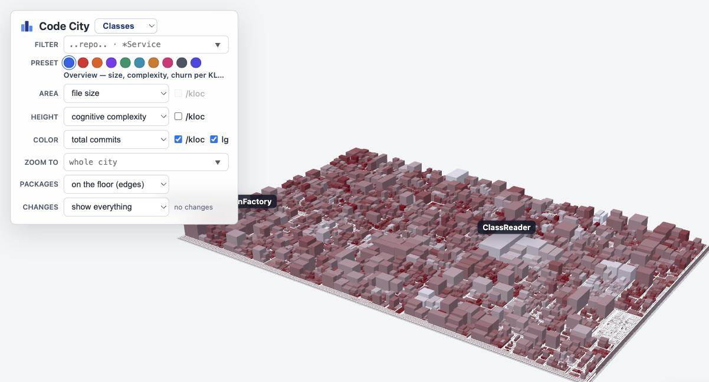

# Code City

Turn any folder of Java sources into a **3-D city you can walk around**: one building
per file, districts per package, its height and colour driven by whatever you want to
see — complexity, churn, bug-fixes, coupling. Plus the 2-D **codemap** it grew out of:
a treemap (area = file bytes, colour = a metric ratio) next to a log–log scatter.

Every output is a **single self-contained HTML file** — all data inlined, libraries from
a CDN, no server. Mail it, publish it on Pages, open it from disk.



*The Spring Framework: 5003 classes, 565 packages, 23 modules — one run, one page.
Height is cognitive complexity, colour is commits per KLOC on a log ramp. The plate is
~12x wider than PetClinic's because the codebase is ~160x bigger: ground area is total
lines, so the two cities are to scale with each other.*

## Quick start

```bash
git clone https://github.com/victorrentea/code-city ~/code-city
~/code-city/generate.sh ~/workspace/your-repo      # any git checkout of Java sources
open ~/workspace/your-repo/.codecity/codecity.html
```

That is the whole configuration: the repo to analyse. The first run vendors the
tree-sitter parsers into `.pylibs/` (needs `python3` + `pip3` + `git`); later runs skip it.
Output lands in `REPO/.codecity/`:

| File | What it is |
| --- | --- |
| `codecity.html` | the 3-D city (Three.js) |
| `codemap.html` | the 2-D treemap + scatter (Plotly) |
| `combined.html` | both, side by side, hover-linked |
| `*.tsv` | the measurements, if you want to plot your own |

`generate.sh REPO OUT` also takes an explicit output directory, and every knob has an
env-var twin (see [Configuration](#configuration-env-vars)) for CI use.

**Live example:** the city of the repo these generators grew up in —
[Spring PetClinic](https://victorrentea.github.io/petclinic/petclinic-backend/docs/generated/codemap/codecity.html).

## What each metric means

The treemap color is a **ratio** of any numerator over any denominator (selectable in
the page): `bugs`, `commits`, `complexity`, `fan_in`, `fan_out` over `lines`, `commits`,
etc. The scale is clamped at the p95 so a few extreme files don't wash out the rest.

**Open a file in your editor:** ⌘/Ctrl-click a file tile to jump straight to it. An
in-page picker chooses **VS Code** (`vscode://file/…`) or **IntelliJ**. IntelliJ uses its
built-in web server, so the IDE must be running with *Settings ▸ Build, Execution,
Deployment ▸ Debugger ▸ "Allow unsigned requests"* enabled. Disable the whole feature by
unsetting `HEATMAP_OPEN_IN`.

| Column | Meaning |
| --- | --- |
| `commits` | non-merge commits that touched the file (full history) |
| `bug_commits` | of those, commits whose subject is a Conventional-Commit `fix:` |
| `cognitive_complexity` | Sonar-style cognitive complexity (tree-sitter, summed over methods) |
| `cochange_out` | of the commits that touched this file, the share that also reached outside its package, weighted by how far out ([Change coupling](#change-coupling--the-crime-scene)) |
| `fan_in` / `fan_out` | how many repo files reference this file / it references (internal coupling only); `coupling-edges.tsv` holds the same relation edge by edge, weighted by reference count — what the Coupling-streets overlay draws |

## Pipeline

| Step | Script | Produces |
| --- | --- | --- |
| 1 | `compute_complexity.py` | `complexity-per-{class,file}.tsv` |
| 2 | `compute_fanio.py` | `fanio-per-file.tsv` + `coupling-edges.tsv` (the edges those counts aggregate) |
| 3 | `build_heatmap.py` | `codemap.tsv` (joins git history + file size + steps 1–2) + `cochange-edges.tsv` (who changes with whom, from the same history walk) |
| 4 | `render_heatmap.py` | `codemap.html` |
| 5 | `render_codecity.py` | `codecity.html` |

## CodeCity

`codecity.html` renders the same TSV as a Three.js CodeCity. Drag to pan,
Cmd/Ctrl-drag to rotate, scroll to zoom around the mouse cursor, and Cmd/Ctrl-double-click
a building to open its Java file in VS Code. The 2D city layout is computed in-browser
with D3 treemap; Three.js extrudes each file tile into a building.

**City geometry & camera** — tuned to Wettel's original CodeCity plates. The ground is
a **landscape rectangle** (1.6:1), not a square, and the opening shot is *computed* from
the city's bounding box rather than hard-coded: a long 30° lens placed far enough back
that the whole plate fits, low over the horizon and swung off-axis. There is **no fog** —
far districts stay as crisp as near ones.

**The plate is the size of the codebase.** Ground area grows with total lines at a fixed
density, so a file of a given size gets the same footprint in every repo and two cities
are to scale with each other (Spring's plate is ~12x wider than PetClinic's). Everything
drawn *on* the plate — streets, package-name bands, the height scale — is sized from ONE
TILE rather than from the plate, which keeps a 5000-file city looking like a 90-file one
seen from higher up. That is also the honest picture: it IS the same city with more of it.

- **height** scales with the tile too, and above the p95 the curve goes logarithmic, so
  one monster class doesn't spike the whole skyline;
- **streets narrow with nesting depth** — boulevards between top-level modules, alleys
  between leaf packages, instead of one flat gap that eats a deep tree's plate;
- a class **name appears only once its roof is ≥ 26 px on screen** (waived in *highlight changed*), so a huge city
  zoomed out is a clean plate and the names come back as you zoom in;
- **package names are written flat on their own floor**, in a margin the treemap
  *reserves* on all four edges of every district, and written into each of them — so
  whichever way you orbit, a copy faces you. The margin is not decoration: children
  terraces rise above their parent's floor and tile all of it, so text laid anywhere
  else is buried. Its width is the *same at every nesting level* (the letters overhang
  it to stay readable): how big a package is, is what the plate already shows — the
  name is an identifier, not a metric;
- the **depth buffer is logarithmic** and the near plane rises with the plate. Without
  both, a big city flickers where surfaces meet (a base on its floor, a name on its
  terrace) — even standing still, because camera damping never quite stops.

**The control panel** stacks one knob per row, each row a single question, so the three
visual axes read as independent choices rather than one wide toolbar:

| row | what it sets |
| --- | --- |
| `FILTER` | AspectJ-style glob (`victor..*Service`, `..repo..`, `*Service`). It is a text box **with a dropdown** (its chevron always visible, or nobody finds it): the generator offers the biggest packages (`..rest.*`, `..repository.*`) and the CamelCase class families it finds — every leading word shared by ≥ 3 classes (`..Pet*`, `..Owner*`) — each with its class count. |
| `PRESET` | ten coloured bubbles, one click each: a saved reading of the city (overview, hotspots, bug density, complexity density, knowledge risk, coupling, instability, churn vs. team, plain size, dependencies). A bubble sets all three metrics *and* the four bits below; the row's caption spells out which reading you are on, and reads *Custom* as soon as you turn any knob under it. |
| `AREA` / `HEIGHT` / `COLOR` | the metric on that axis, plus a **`/kloc`** checkbox that swaps a raw count for its density twin (complexity, commits, bugfixes). Where no density exists the checkbox greys out instead of disappearing, so the rows keep their shape. Colour also carries **`lg`**, the log-vs-linear ramp: it ticks itself to what the chosen metric wants and remembers your override per metric for the session. |
| `ZOOM TO` | drill into one package by name, with autocomplete over every package in the current lens — the typed form of shift-clicking a floor. |
| `PACKAGES` | package-name style: floating tags, on the floor, or off. |
| `CHANGES` | the change-set filter (below). |

Whatever one metric dropdown shows is greyed out in the other two — spending two of the
city's three channels on the same number says nothing twice.

**Change-set filter:** a **Change set** selector focuses the city on the files in the
*current git change set*, baked in when the page is generated. Three modes:

1. **show everything** — the normal city.
2. **highlight changed** (**the default**, whenever a change set was detected) — unchanged
    buildings drain to grey and drop to 50% opacity,
    so the change set holds the only real colour on screen. It is also the only mode
    that **names** buildings: every changed building becomes a label candidate, ranked
    by how much of it the eye already caught — its **volume** (footprint × height) and
    its **intensity** on the colour ramp, whichever of the two is stronger — and the
    screen is then filled top-down with as many of those names as actually fit at the
    current camera (the "roof too small to own a name" gate is waived here, and the
    control panel's own rectangle counts as taken, so no name hides under it).
3. **only changed** — unchanged buildings are removed from the layout entirely, so the
    treemap collapses to just the change set.

A generated city is nearly always being read to answer *what did this change?*, so the page
**opens on the diff** rather than making the reader find the selector first. When no change
set could be detected the **whole Changes row is removed** — three modes that would all draw
the identical city are not a choice worth offering.

**Where a grown building used to end:** highlighting says *which* files a diff touched, never
*what it did to them* — a class that doubled and one that only moved a line are the same shade
of not-grey. So in *highlight changed* every building that GREW carries two dashed black marks,
the only ink on a building anywhere in the city:

- a **band around the facade** at the height the block used to reach — the *height* axis;
- a **rectangle on the roof** enclosing the footprint it used to have — the *area* axis.

The building itself is untouched — same size, same colour the city would give it anyway — so
nothing is exaggerated: the marks simply say where it ended before. They are drawn with
`Line2`, because WebGL ignores `linewidth` and one pixel is not a mark on a building. The
hover spells the same delta out in numbers: `size: 9.8 KB was 7.5 KB`.

**Only growth is marked.** A file that got *smaller* carries no mark — shrinking is the outcome
nobody has to be warned about — and neither does one the diff **added** (all of it is new) nor
one whose metrics did not move the geometry enough to separate a mark from the edge it sits on.

The before-metrics are recovered from git at the very ref the change set is a diff of (the
same one that decided which buildings light up — no second notion of "the diff"): size, LOC
and cognitive complexity from the file's **blob** at that ref, scored in memory; commits,
bugfix commits and committers from the history walk **stopped** at that ref. Stepping through
the commit dropdown re-marks the city along with the highlight. Two limits, both deliberate:
**fan-in / fan-out / instability** are whole-repo facts that would need every source re-parsed
at the base ref, so an axis driven by one of them gets no mark rather than a guess; and a
**deleted** file has no row in the city at all any more. Package buildings sum their files'
befores (classes and packages only — module rows carry no file→module map in the page).

What counts as "changed" is **auto-detected** — no configuration needed (computed
against `HEATMAP_REPO`, in precedence order):

- On a **PR / feature branch** (there are commits ahead of the base branch) → the whole
  branch diff `base...HEAD` plus any uncommitted edits: *everything this PR touches*. The
  base branch is detected from `GITHUB_BASE_REF` in GitHub Actions, otherwise from the
  remote's default branch (`origin/HEAD` → `origin/main`). Sitting **on** the base branch
  (e.g. `main`) is not a PR.
- else, **uncommitted work** (staged + unstaged + untracked vs `HEAD`) *that touches a file
  the city renders* — *you haven't committed yet, so you see the files you've changed*.
- else, the **most recent commit that touches an analysed file** — usually `HEAD`, but the
  detection keeps **walking back through history** past commits that only moved docs,
  configs or non-Java tests. Without this, a repo whose last few commits were a README
  tweak and a module rename would render an empty change set: nothing highlighted, nothing
  to look at. (Merge commits are skipped; the walk gives up after 2000 commits.)

`HEATMAP_CHANGED_BASE` is **optional** — it only *overrides* the auto-detected base (e.g.
to diff against a release branch instead of `main`); you never need to set it for the
normal PR / dirty-tree / last-commit flow.

When the change set is empty the highlight/hide modes are disabled and the selector
reads "no changes".

**What am I looking at?** Picking *highlight changed* or *only changed* reveals a one-line
readout under the selector naming the **source of the diff**, because "42 changed" alone
never says *changed relative to what*:

| Source | Reads | Links to |
| --- | --- | --- |
| PR | `PR #123` + its title | the PR on GitHub |
| feature branch with no PR yet | `branch feat/x` + `all commits since origin/main …` | the GitHub `compare/` view |
| commit (incl. one found by walking back) | a **dropdown** of the last 10 commits that touched code, then `a5d03cb` + `3 days ago` | the picked commit on GitHub |
| dirty tree | `working tree` + `N uncommitted files on <branch>` | — (nothing to link to) |

The line truncates with an ellipsis to the panel width; **hovering** shows the full commit
message / PR body, and **clicking** opens it on GitHub. The PR number comes from
`GITHUB_REF` on CI, else from `gh pr view` locally (both best-effort — with neither, a
branch falls back to the compare link).

**Stepping back through history.** When the diff comes from a commit, being pinned to
whatever landed last is arbitrary — so the generator bakes the **last 10 commits that
really touched rendered code** (same walk, same docs-only skipping) into a dropdown.
Picking one re-flags the whole city against that commit and updates the id next to the
combo, which links to it on GitHub. Each entry carries its change scope pre-computed in
the three key spaces the datasets use — file path, dotted package, module dir — so
switching is a `Set` lookup per row and the Classes / Packages / Modules lenses all stay
correct without re-deriving any path logic in the browser.

**Coupling streets:** tick **Coupling → streets** (off by default) and the building under
the cursor shows the dependency edges it sits on, laid across the plate as **roads**: out of
its base, around whatever stands in the way, and in at its peer's. They ran as *pipes under
the city* first, which is the more honest picture of a dependency — buried, load-bearing, not
yours to re-route — but reading them cost a glassed plate, and the plate is the city. A road
is the reading you can walk. On **hover only**, so the question stays "what does *this*
building touch", never a layer left switched on. (It works with the mouse parked: ticking the
box replays the hover.)

What makes the bundle readable:

- **They go AROUND the blocks.** The straight L between two bases is the shortest road and the
  wrong one — it drives through whatever happens to stand between them, and a road through a
  building is not a road. So the plate is **gridded** once per rebuild (pitch `ROAD_CELL`,
  coarsened automatically so a 5000-class plate never sweeps more than 120k cells), every
  footprint marked built-up, and each bundle routed over the free cells. A **turn costs
  `ROAD_TURN_COST` cells' worth of detour**, which is what keeps the result reading as roads
  and not as staircases — a plain BFS gives shortest paths that zigzag every other cell.
- **One search per hover, not one per peer.** Dijkstra runs once from the hovered building
  over `(cell, heading)` states; every peer then just walks the sweep back from whichever cell
  around its own footprint was reached most cheaply. Eighty roads cost what one costs. Boxed
  in with no route at all, that one edge falls back to the straight L rather than vanishing.
- **Traffic tells you which way it runs.** A static band says two files are coupled, not which
  depends on which — half of what you hovered to find out. So the roads carry traffic: blue
  wedges sliding along the lane, always the way the dependency points, so whatever depends on
  the hovered building flows **into** it and whatever it depends on flows **out**. The
  distance already travelled is written into each run's UVs, so a wedge crosses a corner
  without restarting. One texture, one material, one offset assignment per frame.
- **Two blues.** The roadway is pale, the traffic on it is deep blue. Coupling is
  infrastructure, and the city underneath is already spending red on its own metric.
- **Width is coupling strength.** `coupling-edges.tsv` carries a `weight` — how many times the
  source names the target, comments and string literals already stripped — so an import used
  once and one used thirty times are not the same road. The scale is read off the whole lens
  (95th percentile, log ramp), not off the hovered bundle, so "wide" means the same thing on
  every building instead of "the widest one here".
- Roads **do not all meet at the building's centre**. Each one leaves (or arrives) at the
  point of the footprint facing its peer, so the bundle fans out in the directions the
  couplings actually run — which is itself information, the city being laid out by package.

The two coupling lines in the hover tooltip say how many roads are actually on screen
(`outgoing coupling (fan out): 17 (17 roads)`). It reads `12 of 40 drawn` when peers are
hidden by the filter or the drill scope, or when the per-direction cap of 80 kicks in — a
bundle must never pass for the whole number above it.


**The city from underneath.** Orbit below the horizon and the plate is between your eye and
the only things down there worth looking at. So once the camera drops under the plate's top
face, **the ground and every district terrace turn to glass** (12% opacity) and the buildings
stay solid — their undersides are exactly what you came down there to see. Above the plate
nothing changes.

The edges are baked into the page **per lens** — class → class, package → package, module →
module — with a level's internal edges dropped (so a package never roads to itself) and their
weights summed as they fold up. A build whose `codemap.tsv` has no `coupling-edges.tsv` beside
it (an older run of the tool) renders normally, with the Coupling row removed; an edge file
from before the weights simply values every edge at one reference.

**What is not an edge.** `compute_fanio.py` finds same-package references by scanning the
file for sibling class names, so comments and string literals are **blanked out first**: a
`{@link SpecialtyRestController}` in a Javadoc block is a cross-reference for a human
reader, not a compile-time dependency, and counting it both inflates `fan_out` and draws a
wire between two classes that never call each other.

## Change coupling — the crime scene

*Files that change together belong together.* The inverse is a smell you cannot see in the
code at all, only in its history — and how bad it is depends on how far apart the two live: a
class that keeps changing with its next-door package is a seam, one that keeps changing with
the far side of the tree is a concept that was never given a home.

`build_heatmap.py` gets both out of the history walk it already does, and drops any commit
touching more than `HEATMAP_COCHANGE_MAX_FILES` files (default 30) whole — a squash merge, a
reformat or a rename sweep couples everything to everything and drowns the real signal.

**The colour metric — `cross-package co-change`.** Per building, in [0,1]: of the commits that
touched it, what share also reached **outside its own package**, weighted by how far outside.
Distance is tree steps (same package 0, parent/child 1, siblings 2, …) put through `d/(d+2)`,
which saturates — past "another corner of the codebase" there is no meaningful further away —
and is a fixed curve rather than a per-repo maximum, so the number means the same thing in two
different repos. Each commit charges a building its **worst** escape, not the sum: a commit
either left the package or it did not. Put it on `COLOR` and the city lights up its own
misplaced classes with nobody hovering anything — in PetClinic, every DTO goes red, because a
DTO never changes alone.

**The hover overlay — Shift+hover.** It has no checkbox of its own: it IS that colour metric,
asked of one building. Pick `cross-package co-change` on `COLOR` — the city then shows you
*which* classes leak out of their package — and **hold Shift over one** to see *who* they leak
to. (Shift is the drill-in modifier everywhere else; over a building, while this metric is up,
it answers this question instead, and shift-clicking a floor still drills.) The city
answers: who else, **outside this package**, keeps landing in the same commits?
Everything not implicated drains to grey, the hovered building goes deep blue — it is the
question, not one of the answers — and every cross-package partner keeps the city's own
light→burgundy ramp, its shade being *how often they changed together x how far apart they
live*, ramped against that building's own worst partner rather than the repo's.

Deliberately **not wires**. A line from A to B says "these two are related" and then spends the
reader on where the line goes; what matters here is the **set** — which buildings, in which
districts, how scattered — and a set is read off colour, over the whole plate at once, which is
the thing a bundle of lines is worst at. Same-package partners are not in the data at all: two
classes of one package changing together is the package doing its job.

`cochange-edges.tsv` carries the pairs (`shared` commits + `severity`), keyed per lens like the
coupling edges, capped at `HEATMAP_COCHANGE_TOP` (20) partners per building and
`HEATMAP_COCHANGE_MIN_SHARED` (2) shared commits. Severity travels *in the file* rather than
being recomputed in the browser: the distance model is the single source of truth for how bad a
jump is, and a second copy of that curve in JS would be a second answer.

## Performance on a big repo

Measured in headless Chromium on Spring Framework (5003 classes, 565 packages, 31509
commits), against PetClinic (90 classes) as the small case. Two scripts here do it, both
needing `pip install playwright && playwright install chromium`:

- `./profile_city.py page.html "label"` — page errors, time to first frame, GL draw calls
  per frame, idle and panning frame rate, and a CPU profile of each hover overlay;
- `./hover_cost.py page.html "label"` — the cost of ONE hover, timed inside the handler.
  `onPointerMove` is a synchronous listener, so dispatching the event from in-page and
  timing around it measures exactly what the main thread is asked to do when the mouse
  crosses one building. This is the number that decides whether a held key freezes the tab.

**Dismiss the first-run intro before measuring anything.** While it is up, `onPointerMove`
returns early — no tooltip, no overlay, no work — so a probe that skips it profiles nothing
and reports it as fast. The first round of these numbers was collected that way and said
every overlay was free; the real ones were four orders of magnitude worse.

| | PetClinic | Spring |
| --- | --- | --- |
| generate | 6 s | 29 s, 407 MB peak RSS |
| page | 300 KB | **4.5 MB** (8.7 before the adjacency keys were interned) |
| draw calls / frame | 318 | **10334** |
| ⌥ hover, median / worst | 0.1 / 7.7 ms | 2.9 / 36.6 ms |
| plain hover, median | 0.1 ms | 2.7 ms (raycasting 5003 meshes) |

What that took:

- **The routing sweep was the freeze.** A grid of 120k cells x 4 headings, on a heap that
  allocated a pair per pop, cost **2 to 22 SECONDS per hover** — on the 90-class city. Hold
  the key, move the mouse, and the tab was gone. Three things fixed it, to 7.7 ms worst:
  the grid is capped at 24k cells; the heap is two flat typed arrays with the pop landing
  in scratch variables instead of a fresh pair; and the sweep **stops as soon as every peer
  in the bundle has been reached**, which on a normal bundle of neighbours is a small
  fraction of the plate. A coarse grid also has to mark a cell built-up only when a
  footprint covers its CENTRE — "any overlap" walls off the gaps the treemap left.
- **Interning the adjacency keys halved the page.** Written out in full, `COUPLING` and
  `COCHANGE` were 5.8 MB of an 8.7 MB page: mostly the same long paths over and over.
- **A bundle of eighty roads is two draw calls**, one merged geometry per surface. A mesh
  per straight run is a couple of thousand of them.
- **The co-change overlay drains to OPAQUE grey.** Translucent moved five thousand
  buildings out of the opaque pass into the sorted one: 683 ms of `drawElements` per hover.
- **What is left is the city's own shape**: 10334 draw calls a frame on Spring, a fifth of
  them floor labels written on all four edges of every district — unreadable at full-city
  zoom. Gating those by district size on screen, the way class names are already gated by
  roof size, is the obvious next cut.
- **The shadow pass draws zero objects** in every city measured — same count with shadows
  on, off, or cached — so a big city has no real shadows and does not pay for them either.
  The sun's shadow camera is not covering the plate; that is a bug of its own.

**First-run intro:** on initial load the page draws a one-time overlay that annotates a
single "hero" building to make the three selectors concrete — the hatched **roof** = the
*area* metric, the **height** dimension line = the *height* metric, the **colour swatch** =
the *colour* metric — each tied by a connector line to the `<select>` that drives it. When the
city opens with **change marks** up, a fourth card joins them, pointing at a real dashed
rectangle and naming the axis it measures (`dashed = its old footprint`): the marks are the
one thing on a building the three metric selectors do not explain. Dismissed on the first
drag/scroll/metric-change (or the "Got it" button).

**Build it for your own repo:** every generated page carries a compact **"⚒ Build for your
repo"** button in the **bottom-left corner**, which opens the three-line recipe at the top
of this README. It clones *this* repo — a reader who opens a published city has no local
checkout of the generators to point at.

`fetch_bugs.py` is the Spring-specific GitHub bug-label crawler from the original; it is
kept for provenance but **not** used by `generate.sh`, which reads the bug signal from
Conventional-Commit `fix:` subjects instead (`HEATMAP_BUG_COMMIT_REGEX`).

## Tests

```bash
python3 -m pytest test_render_codecity.py
```

The renderer is exercised against `testdata/` — a real, small run of the pipeline — so the
tests need no checkout to analyse and stay fast.

## Configuration (env vars)

Every script is repo-agnostic and driven by env vars (`generate.sh` sets them):

| Var | Purpose |
| --- | --- |
| `HEATMAP_REPO` | repo root to analyze (default: git toplevel of the script) |
| `HEATMAP_OUT` | directory for all `.tsv` / `.html` output (default: `HEATMAP_REPO`) |
| `HEATMAP_PRUNE` | comma-separated dir names to skip (build output, worktrees, …) |
| `HEATMAP_PYLIBS` | path to vendored tree-sitter (for `compute_complexity.py`) |
| `HEATMAP_BUG_COMMIT_REGEX` | regex on the commit subject that flags a bug-fix commit |
| `HEATMAP_BUG_FILE` | optional file of bug **issue numbers** (Spring mode; matched via `gh-NNN`/`#NNN` refs) |
| `HEATMAP_TITLE` / `HEATMAP_SUBTITLE` | page heading text |
| `HEATMAP_OPEN_IN` | `vscode` / `intellij` to enable ⌘/Ctrl-click-to-open (empty = off) |
| `HEATMAP_REPO_ABS` | absolute repo root for editor links (default: `HEATMAP_REPO`) |
| `HEATMAP_CHANGED_BASE` | **optional** override of the auto-detected base ref for the change-set filter (e.g. `origin/release-1.x`); unset = auto-detect PR base → uncommitted work → last commit |

## Provenance

These generators were originally written ad-hoc to produce the
[Spring Framework codemap](https://github.com/spring-projects/spring-framework) and
were recovered from a Claude Code session transcript, then parameterized (paths/title via
env, plus a Conventional-Commit bug mode) without changing their analysis logic. The
recovered generators were verified to reproduce the original Spring artifacts
byte-for-byte (`codemap.html`, both complexity TSVs, and `fanio-per-file.tsv`), and
every deterministic column of `codemap.tsv`.
